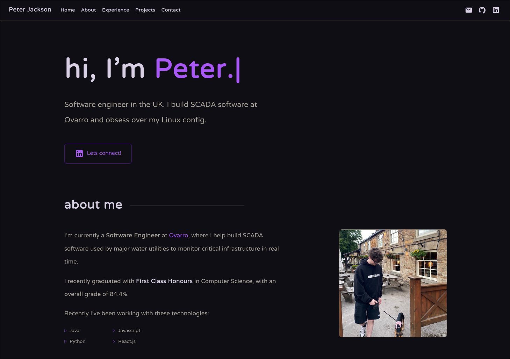

<h1 align="center">
peterjacksonn.com
</h1>
<p align="center">
  My personal portfolio  <a href="https://peterjacksonn.com" target="_blank">peterjacksonn.com</a> , built with Vite and React 19.
</p>
<p align="center">
  
</p>

## Setup

1. Install dependencies

   ```sh
   pnpm install
   ```

2. Start the dev server

   ```sh
   pnpm run dev
   ```

## Build

1. Generate a static production build

   ```sh
   pnpm build
   ```

2. Preview the production build locally

   ```sh
   pnpm preview
   ```

